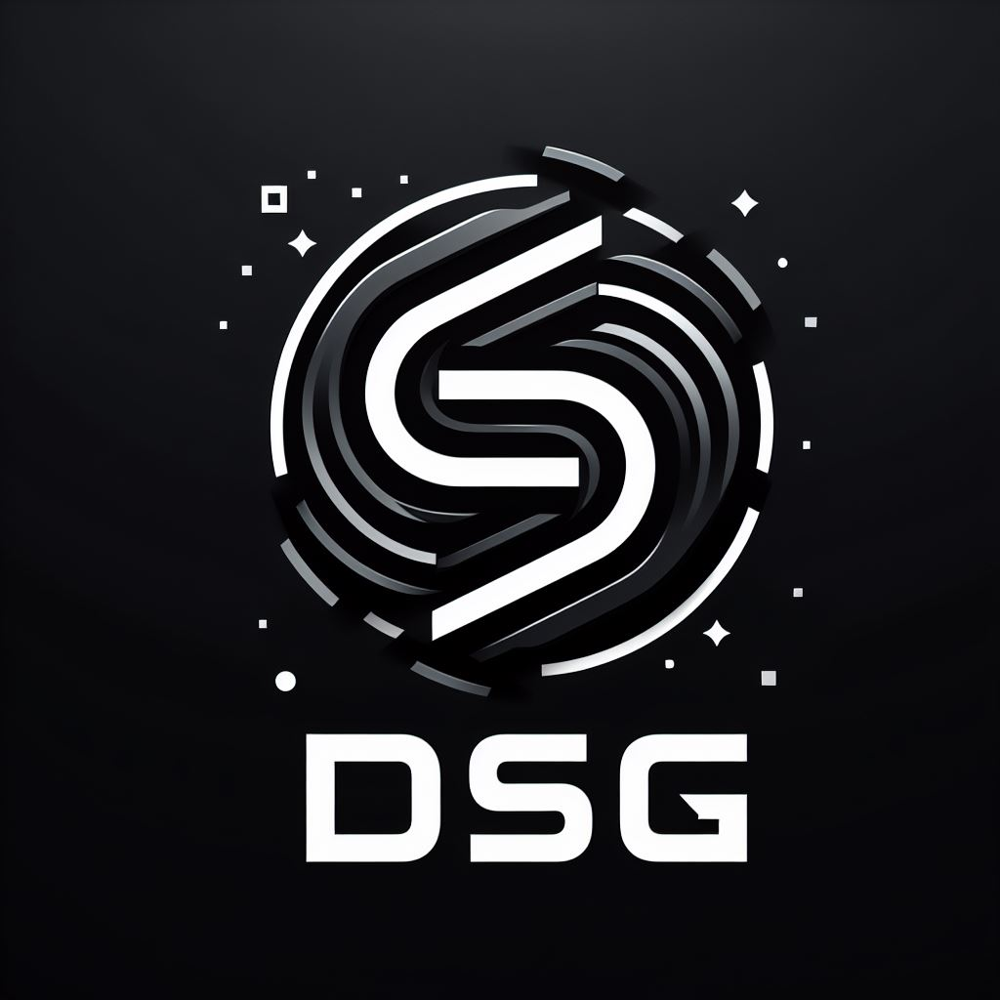
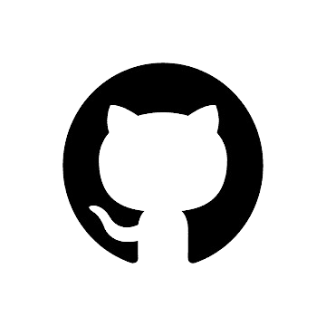

# API-2
API 2 semestre

  

<h1>DSG - DATA SOLUTIONS GROUP</h1>
 
 > Status: Developing ⚠️

<h1 align="center"> Sprint 1: 25/03/2024 a 17/04/2024 </h1>

 
    <a href="#backlog">Backlog</a> |
    <a href="#burndown">Burndown</a> |
    <a href="#pbacklog">Product Backlog</a> | 
    <a href="#equipe">Equipe</a> |
  
<h2>💡Sobre o Projeto:</h2>

Desenvolver um programa de gestão de projetos eficiente e fácil de usar que permita aos usuários gerenciar, atualizar e colaborar em projetos de qualquer escala. Onde a principal função sera monitorar e evidenciar em graficos os relatorios de cada agente, da area percorrida e atividades realizadas dentro da Geometria solicitada e demandada por Gestor de Projetos. Ou seja o principal objetivio é criar um sistema onde é possivel realizar relatorios diarios sobre atividades exercidas e realizadas separando elas pontualmente a cada usuario criado e utilizado no sistema 

## 📝Requisitos Funcionais
* O gestor deverá ser capaz de carregar o polígono que delimita a área do projeto
* O gestor deverá ser capaz de carregar a grade de polígonos especificando as dimensões de cada recorte (retângulo)
* O gestor deverá ser capaz de cadastrar editor e revisor
* O gestor deverá ser capaz de definir a área de trabalho do usuário. A área de trabalho é um retângulo na grade
* O gestor deverá ser capaz de gerar as estatísticas: número de polígonos, área total, quantidade de correções e quantidade de correções executadas
* O gestor deverá ser capaz de filtrar por revisor e por período para gerar as estatísticas;
* O gestor deverá ser capaz de gerar estatísticas de quantidade de polígonos mapeados, quantidade de correções e de área de polígonos mapeados por editor
* O gestor deverá ser capaz de visualizar e exportar relatórios com as estatísticas no formato PDF.

## 📚Requisitos Não Funcionais
* Documentação no GitHub: repositório do código fonte de cada sprint, descrição do projeto, link para cada entrega de sprint, backlog do produto, backlog de cada sprint, requisitos do cliente (user stories), prints das telas ou link para o portal, burndown de cada sprint mostrando funcionalidades (quantidade de requisitos) implementadas versus tempo,tecnologias utilizadas e membros da equipe (link para o GitHub de cada membro)
* Utilizar o Trello para gerenciar o backlog do produto. Preferencialmente fazer a integração entre o Trello e GitHub
* No Trello, cada cartão representa uma tarefa ou uma história de usuário
* Os membros da equipe podem adicionar links para problemas do GitHub relevantes a cada cartão no Trello
* Quando um membro da equipe começa a trabalhar em uma tarefa, ele pode mover o cartão correspondente para a coluna "Em progresso"
* Quando o trabalho em uma tarefa estiver concluído e um pull request for aberto no GitHub, o membro da equipe pode adicionar o link do pull request ao cartão no Trello
* Os membros da equipe podem monitorar o progresso das tarefas no Trello e visualizar os links para os problemas e pull requests correspondentes no GitHub.
* Back-end: TypeScript e Node.js;
* Front-end: React TypeScript, HTML e CSS;
* Armazenamento: SGBD PostgreSQL;
* Autenticação de usuário.

<h1>⚙️Backlog</h1>

<h1>⚙️Burndown</h1>

<h1>⚙️Product Backlog</h1>

<h3>Video do Projeto</h3>
<a href="">Video a ser adicionado </a>

### exemplo
**Sprint**  | **Inicio / Fim** | **Status**         | **Link**
:---------: | :------:    | :-------:          | :-------:
01          | 25/03 - 17/04   | ✅                | <a href="sprint1/sprint1.md">Sprint 1</a>
02          | 22/04 - 15/05   | ✅                | <a href="Sprint 2/README.md">Sprint 2</a>
03          | 20/05 - 12/06   | ✅                | <a href="Sprint 3/README.md">Sprint 3</a>

## 🚀Ferramentas Utilizadas

## 👩‍💻Equipe

| Função         | Integrantes           |
| ---------------|-----------------------|
| Product Owner  | Renan Ming Han         |
| Scrum Master    | Rodrigo Augusto Silva Lima             |
| Dev Team     | Fillipe Pereira Bueno de Almeida             |
| Dev Team     | Evellin Amorim da Silva         |
| Dev Team | Tiago Santini Da Silva         |
| Dev Team | Isaac Souza Santos         |
