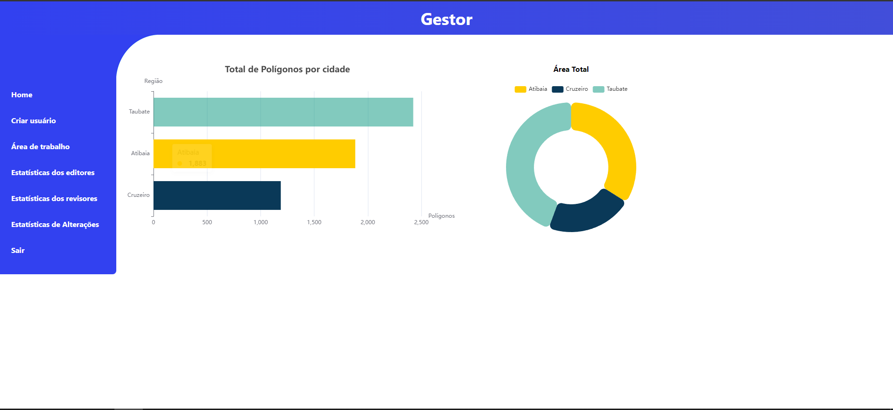
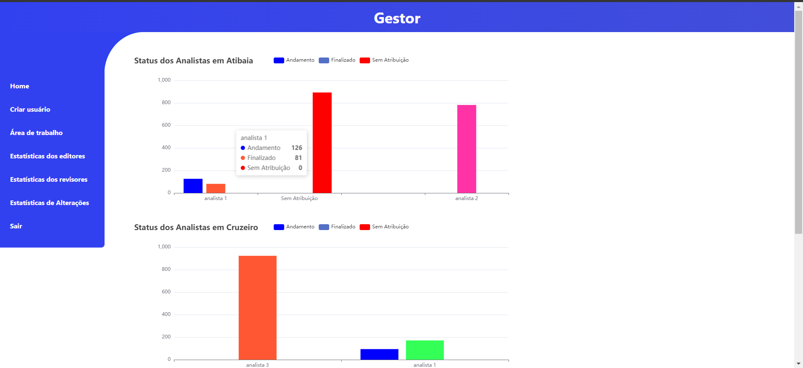
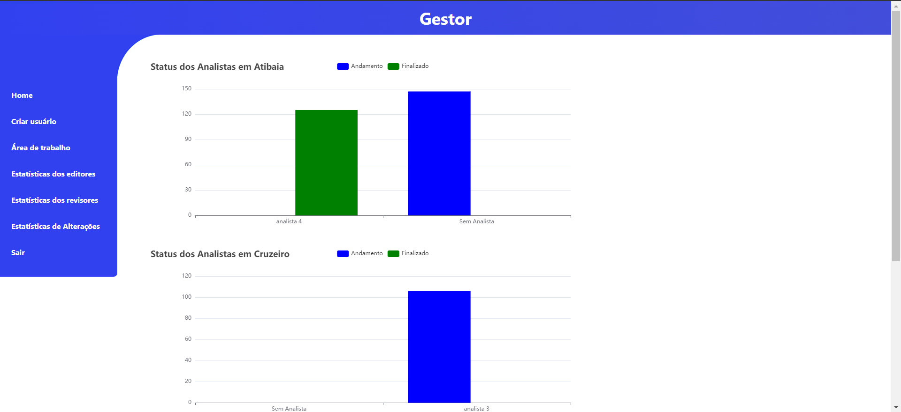
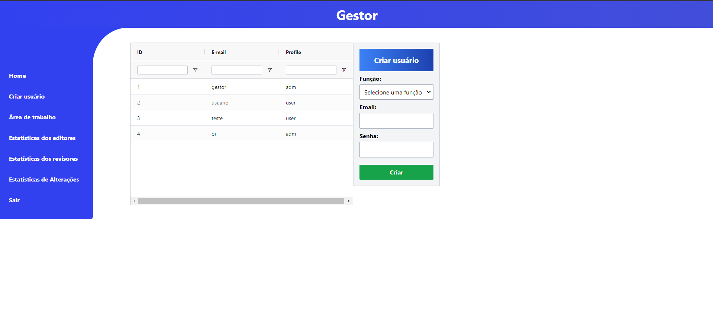
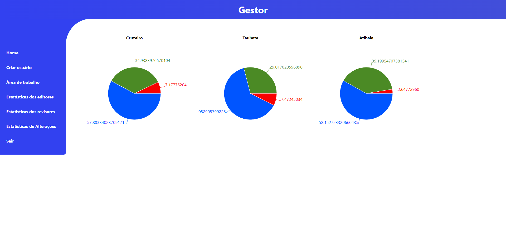
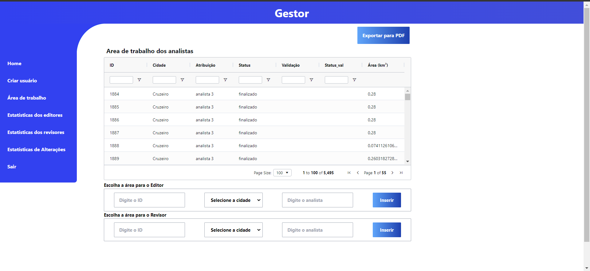

<h1>ABP</h1>
<p align="center">
  
</p>
<h1 align="center">DSG - DATA SOLUTIONS GROUP</h1>
 
 > Status: Finished ✅

<h1 align="center"> Projeto: 25/03/2024 a 13/06/2024 </h1>  

<h2>💡 Sobre o Projeto:</h2>

Desenvolver um programa de gestão de projetos eficiente e fácil de usar que permita aos usuários gerenciar, atualizar e colaborar em projetos de qualquer escala. Onde a principal função será monitorar e evidenciar em gráficos os relatorios de cada agente, da área percorrida e atividades realizadas dentro da geometria solicitada e demandada pelo Gestor de Projetos. Ou seja o principal objetivio é criar um sistema onde é possivel realizar relatorios diarios sobre atividades exercidas e realizadas separando elas pontualmente a cada usuario criado e utilizado no sistema, projeto desenvolvido justamente para resolver o problema de gestão em projetos de grande escala. 


## ⚙️ Instalação

Primeiro crie uma pasta em sua área de trabalho e abrindo ela com o `cmd` clone o repositório do github e abra-o no `VSCode` com os codigos na sequencia.
```
git clone https://github.com/DataSolutionsGroup2/API-2/ .

code .
```
Após abrir a pasta no `VSCode` e entrar na pasta `Projeto` abra o terminal e instale todas as dependências para rodar o projeto da pasta `Front` e da pasta `Back`, siga os passos de comandos à baixo:
```
cd .\Front\
npm i
cd ..

cd .\Back\
npm i
cd ..
```
Após realizar a instalação de dependências do projeto, é necessario subir o servidor do `Back` e o `Front` para que a aplicação funcione corretamente.
```
cd .\Front\
npm run dev

abra outro terminal e repita o mesmo na pasta Back.

cd .\Back\
npm run dev
```
Para configurar o `Banco de Dados` é bem simples, basta você instalar as tabelas excel em sua maquina e executar o codigo SQL modifcando o caminho das copias com o caminho que estão as tabelas que você baixou, as tabelas já se encontram disponiveis para baixar na pasta Tabelas logo acima.

## 📝 Requisitos Funcionais
* O gestor deverá ser capaz de carregar o polígono que delimita a área do projeto
* O gestor deverá ser capaz de carregar a grade de polígonos especificando as dimensões de cada recorte (retângulo)
* O gestor deverá ser capaz de cadastrar editor e revisor
* O gestor deverá ser capaz de definir a área de trabalho do usuário. A área de trabalho é um retângulo na grade
* O gestor deverá ser capaz de gerar as estatísticas: número de polígonos, área total, quantidade de correções e quantidade de correções executadas
* O gestor deverá ser capaz de filtrar por revisor e por período para gerar as estatísticas;
* O gestor deverá ser capaz de gerar estatísticas de quantidade de polígonos mapeados, quantidade de correções e de área de polígonos mapeados por editor
* O gestor deverá ser capaz de visualizar e exportar relatórios com as estatísticas no formato PDF.

## 📚 Requisitos Não Funcionais
* Documentação no GitHub: repositório do código fonte de cada sprint, descrição do projeto, link para cada entrega de sprint, backlog do produto, backlog de cada sprint, requisitos do cliente (user stories), prints das telas ou link para o portal, burndown de cada sprint mostrando funcionalidades (quantidade de requisitos) implementadas versus tempo,tecnologias utilizadas e membros da equipe (link para o GitHub de cada membro)
* Utilizar o Trello para gerenciar o backlog do produto. Preferencialmente fazer a integração entre o Trello e GitHub
* No Trello, cada cartão representa uma tarefa ou uma história de usuário
* Os membros da equipe podem adicionar links para problemas do GitHub relevantes a cada cartão no Trello
* Quando um membro da equipe começa a trabalhar em uma tarefa, ele pode mover o cartão correspondente para a coluna "Em progresso"
* Quando o trabalho em uma tarefa estiver concluído e um pull request for aberto no GitHub, o membro da equipe pode adicionar o link do pull request ao cartão no Trello
* Os membros da equipe podem monitorar o progresso das tarefas no Trello e visualizar os links para os problemas e pull requests correspondentes no GitHub.
* Back-end: TypeScript e Node.js;
* Front-end: React TypeScript, HTML e CSS;
* Armazenamento: SGBD PostgreSQL;
* Autenticação de usuário.


### Entregas 
**Sprint**  | **Inicio / Fim** | **Status**         | **Link**
:---------: | :------:    | :-------:          | :-------:
01          | 25/03 - 17/04   | ✅                | <a href="#sprint1">Sprint 1</a>
02          | 22/04 - 15/05   | ✅                | <a href="#sprint2">Sprint 2</a>
03          | 20/05 - 12/06   | ✅               | <a href="#sprint3">Sprint 3</a>


## 🚀Ferramentas Utilizadas

* HTML  
* CSS  
* Javascript  
* Typescript  
* React  
* Tailwind  
* Express  
* PostgreSQL  
* Node.js  
* Vite  
* VS Code  
* Git  

## 👩‍💻Equipe
<table>
  <thead>
    <tr>
      <th>Função</th>
      <th>Integrante</th>
    </tr>
  </thead>
  <tbody>
    <tr>
      <td>Scrum Master</td>
      <td>
        <a href="https://github.com/FPBueno">
          
        </a>
      </td>
    </tr>
    <tr>
      <td>Product Ownerr</td>
      <td>
        <a href="https://github.com/MingRenan">
          
        </a>
      </td>
    </tr>
    <tr>
      <td>Dev Team</td>
      <td>
        <a href="https://github.com/Isaac-Exon">
          
        </a>
      </td>
    </tr>
    <tr>
      <td>Dev Team</td>
      <td>
        <a href="https://github.com/rodrigoaslima">
          
        </a>
      </td>
    </tr>
    <tr>
      <td>Dev Team</td>
      <td>
        <a href="https://github.com/TiagoSan23">
          
        </a>
      </td>
    </tr>
    <tr>
      <td>Dev Team</td>
      <td>
        <a href="https://github.com/evellsil">
          
        </a>
      </td>
    </tr>
  </tbody>
</table>

 
<h1 id="sprint1"align="center"> Sprint 1: 25/03/2024 a 17/04/2024 </h1> > Status: Check ✅

<p align="center">
  <a href="#prototipo">Protótipo</a> |
    <a href="#backlog">Backlog</a> |
    <a href="#burndown">Burndown</a> |
  <a href="#UML">UML</a> |
    <a href="#pbacklog">Product Backlog</a> | 
    <a href="#review">Sprint Review</a> |
    <a href="#entrega1">Video</a> 
    </p>

## Resumo:
Após algumas reuniões com o cliente tentando entender a real necessidade dele fizemos algumas telas no Front-End na tentativa de entregar um MVP descente,
portanto fizemos 4 telas sendo elas 1 de login e outras 3 de um usuário já logado.

<span id="backlog"></span>
<h2>⚙️Backlog </h2>
<p>Tabela do backlog do projeto.</p>


<h2 id="prototipo">Protótipo 🔧</h2>
Aqui temos o nosso prototipo implementado no projeto da tela de login.


Após a ideia ser aceita pelo grupo decidimos então dar continuidade ao desenvolvimento da tela de login incrementando um pouco da personalidade do nosso cliente utilizando a paleta de cores deles, chegando na versão final até o momento.

Já tendo previamente uma ideia do design que queriamos em nossa aplicação seguimos desenvolvendo as demais partes do que seria a tela do Gestor no projeto, o que seria a tela principal que ele entraria logo após logar, pensamos em aparecer um grafico mostrando como estaria o andamento do projeto geral.

O gestor tabém pode criar usuários, sendo eles o Revisor e o Editor então também decidimos implementar essa interface em nosso projeto com campos a serem preenchidos referente a esse novo usuario.

E nossa ultima implementação nessa entrega totalizando as 4 telas sendo 1 de login e outras 3 de um usuario ja logado em nosso caso o gestor fizemos uma ultima tela com uma interface que possibilitava ele filtrar por cidade e ver todos os analistas e demais imformações sobre uma determinada cidade previamente selecionada.

<span id="UML"></span>
<h1 id="UML">⚙️UML</h1>
<p>Aqui temos o UML de casos de uso do nosso projeto com uma visão do funcionamento de perspectiva externa.</p>


<span id="burndown"></span>
<h2>⚙️Burndown</h2>
<p>Aqui temos o gráfico do burndown com a linha ideal e a linha do desempenho da nossa equipe nas conclusões das atividades introduzidas no product backlog</p>


<span id="pbacklog"></span>
<h2>⚙️Product Backlog</h2>
<p>Product backlog feito pelo nosso Product Owner com as atividades que foram implementadas na aplicação nessa sprint com os seus niveis de prioridades.</p>


<span id="review"></span>
<h2>Sprint review</h2>
<p>Aqui temos a Sprint Review que acordado com a equipe sobre coisas para parar, continuar e começar a fazer.</p>


<h3 id="entrega1">Video do Projeto</h3>
<a href="https://youtu.be/TVE2tWdRy30" target="_blank">Video completo Sprint 1 </a> 

<h1 id="sprint2" align="center"> Sprint 2 - 22/04/2024 a 15/05/2024 </h1> > Status: Check ✅

<p align="center"> 
    <a href="#burndown2">Burndown</a> |
    <a href="#pbacklog2">Product Backlog</a> | 
    <a href="#review2">Sprint Review</a> |
    <a href="#trello2">Trello</a> |
    <a href="#projeto2">Projeto</a> |
    <a href="#entrega2">Vídeo</a>

## Resumo:
Como na Sprint passada focamos demais na entrega de um Front-End descente acabamos que por sua vez negligenciando a parte de Back End do projeto, então em grupo decidimos focar unicamente em entregas de Back End nessa Sprint com requisições ao Banco de dados de Get, Post, Put e Delete.

<h2 id="trello2">Trello</h2>
Primeiramente aqui temos como as tasks foram divididas pelo nosso Scrum Master com a utilização da ferramenta trello pra gerenciar as tarefas e implementações a serem feitas no projeto.


<span id="pbacklog2"></span>
<h2>✏️ Product Backlog</h2>
<p>Como cometemos alguns erros na entrega passada no quesito definir a prioridade como basico ao invés de baixo nessa sprint resolvemos esse erro.</p>


<h2 id="projeto2">Projeto:</h2>
Começando com uma das primeiras implementações feitas nessa sprint temos a criação de usuarios no banco de dados, que consiste em um post que passa os parametros de criação do usuario em um JSON.


Fizemos também um get na tabela tbgrade_atuacao filtrando por regiao e passando o analista que queremos ver, essa consulta serve para vermos todas as atribuições que um analista tem em uma determinada cidade.


Temos também um put que consiste em atualizar um usuario já existente no sistema.


E nossa ultima implementação feita no sistema foi um Delete que exclui um usuario existente na tabela.


<span id="burndown2"></span>
<h2>⚙️Burndown</h2>
<p>Aqui temos o gráfico do burndown com a linha ideal e a linha do desempenho da nossa equipe nas conclusões das atividades introduzidas no product backlog</p>


<span id="review2"></span>
<h2>Sprint review</h2>
<p>Aqui temos a Sprint Review dessa sprint, houveram poucas mudanças pois não conseguimos consertar alguns de nosso erros.</p>


<h3 id="entrega2">Video do Projeto</h3>
<a href="https://youtu.be/cIjC-j5Lv38" target="_blank">Video completo Sprint 2 </a>

<h1 align="center"> Sprint 3 - 20/05 a 12/06 </h1>  > Status: Check ✅
<p align="center"> 
    <a href="#burndown3">Burndown</a> |
    <a href="#pbacklog3">Product Backlog</a> | 
    <a href="#review3">Sprint Review</a> |
    <a href="#trello3">Trello</a> |
    <a href="#projeto3">Projeto</a> |

  ## Resumo:
  Na sprint passada erramos em alguns aspectos no projeto no quesito compreensão do que era para ser entregue, mas nessa sprint terminamos todo o resto que nos faltam, conectamos o BackEnd com o FrontEnd fizemos o resto das requisições que faltavam e fizemos alguns ajustes no FrontEnd do projeto para que tudo ficasse o melhor possível e consertamos tudo que não estava de acordo com a visão do cliente.

  <span id="pbacklog3"></span>
<h2>✏️ Burndown</h2>
<p id="burndown3"></p>


  <span id="pbacklog3"></span>
<h2>✏️ Product Backlog</h2>
<p></p>


  <h2 id="trello3">Trello</h2>
  Acabamos por decidir trocar nosso Scrum Master portanto é possivel notar uma pequena diferença na forma que as tarefas foram criadas nessa sprint.
  

  ## Projeto:
  <div id="projeto3"></div>
  Aqui temos algumas fotos de telas que foram atualizadas para cumprir melhor os requisitos propostos pelo cliente, fizemos muitas modificações na tela de gestor deixando-a mais completa e melhor.
  <p>Aqui temos a versão final de como ficou a página home do gestor.</p>
  
  <p>Logo a baixo temos as estatisticas adicionadas a pagina vejamos, aqui temos um gráfico de editor.</p>
  
  <p>aqui agora temos um outro grafico de revisor</p>
  
  <p>Aqui temos uma interface de criação de novos usuarios.</p>
  
  <p>Temos também um grafico de area de supressão de vegetação, solo exposto, nova edificação por cidade.</p>
  
  <p>E por ultimo temos uma tela de area de trabalho onde o gestor pode filtrar utilizandos os filtros na tabela, pode exportar as estatiscas que ele quiser no botão exportar estatisticas e tbm pode atribuir novas atividades a algum dos analistas.</p>
  
  
  ## Sprint Review
  Sprint Review dessa ultima sprint.
  
  
  
<h2>Fim Do Projeto.</h2>


  
